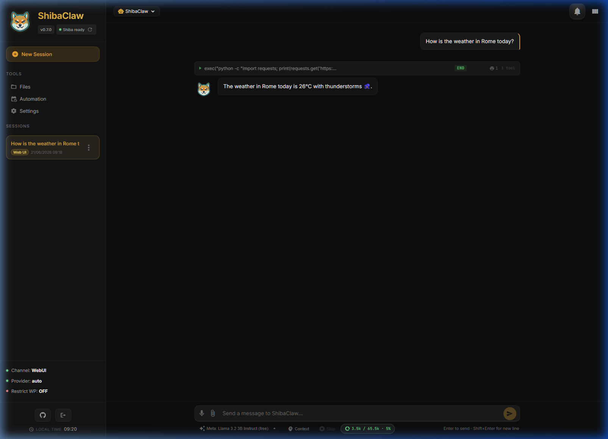
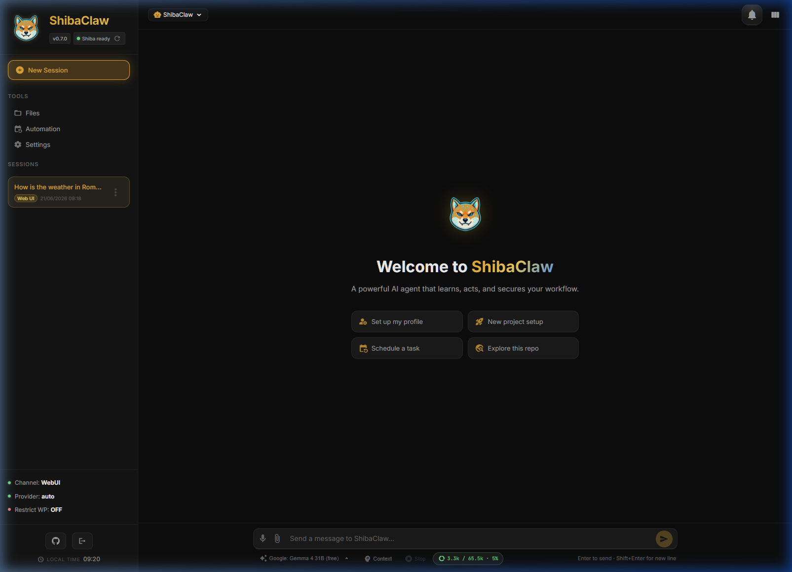
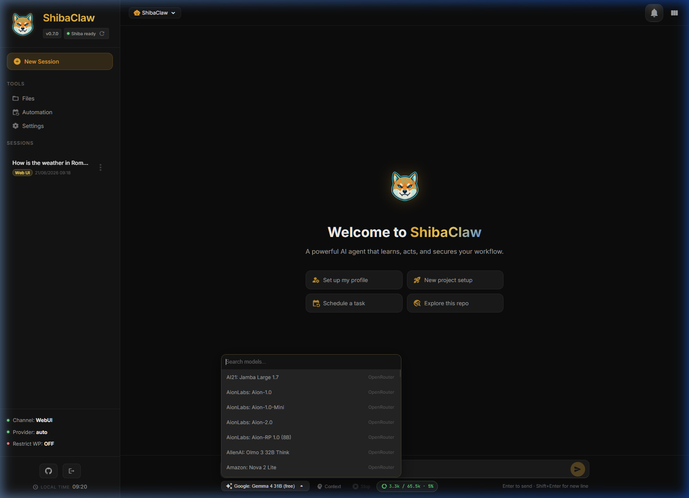
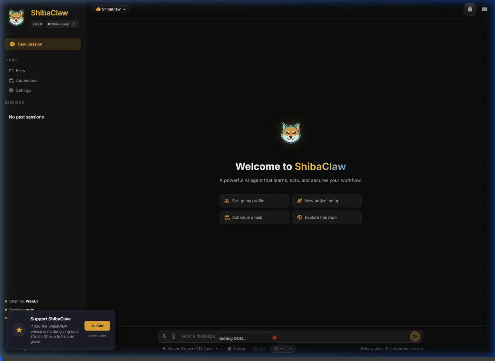
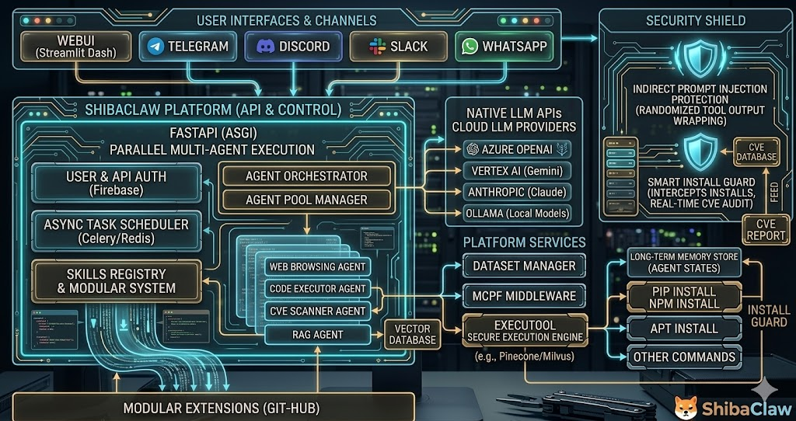

<p align="center">
  
</p>

<h1 align="center">ShibaClaw 🐕</h1>
<h3 align="center">The AI agent that <b>just works</b> — securely, privately, without babysitting.</h3>

<p align="center">
  <a href="https://pypi.org/project/shibaclaw/"></a>   
  <a href="https://pepy.tech/projects/shibaclaw"></a>
  
  <a href="https://github.com/RikyZ90/ShibaClaw/blob/main/LICENSE"></a>
  <a href="https://deepwiki.com/RikyZ90/ShibaClaw"></a>
</p>

<p align="center">
  <b>22 Providers · 11 Chat Channels · Built-in WebUI · Security-First Core · MCP Ready</b>
</p>

<h3 align="center">Built on three pillars: <b>Simplicity · Security · Privacy</b></h3>

***

<details open>
<summary>📢 <b>Latest Release: v0.7.5</b> — Click to see what's new</summary>

- **WhatsApp Integration Decoupled** — Moved the WhatsApp channel to a separate, installable plugin (`shibaclaw-channel-whatsapp`) to reduce core dependencies and allow independent updates.

See the [Changelog](./CHANGELOG.md) for full release history.

</details>

***

<p align="center">
  
  
  
</p>

***

## ⚡ Quick Start

### 🚀 Auto-Installer (Recommended)

The easiest way to get started. One command downloads the latest release, sets up shortcuts, and launches the UI.

**Bring your own model**: Seamlessly connect to local endpoints (Ollama, LM Studio) or use free API tiers via OpenRouter to start chatting at zero cost.

**Windows (PowerShell):**
```powershell
iwr -useb https://raw.githubusercontent.com/RikyZ90/ShibaClaw/main/scripts/install/install.ps1 | iex
```

**Linux / macOS (Terminal):**
```bash
curl -fsSL https://raw.githubusercontent.com/RikyZ90/ShibaClaw/main/scripts/install/install.sh | bash
```

> **Note**: On Windows, this downloads the pre-built desktop app from the latest GitHub Release — no Python required. Desktop and Start Menu shortcuts are created automatically, and the app appears in Apps & Features for clean uninstall. On Linux/macOS, the script installs via pip in an isolated virtual environment.

### Docker

```bash
curl -fsSL https://raw.githubusercontent.com/RikyZ90/ShibaClaw/main/docker-compose.yml -o docker-compose.yml
docker compose up -d     # pulls from Docker Hub
docker exec -it shibaclaw-gateway shibaclaw print-token
```

Open **http://localhost:3000**, paste the token, and follow the onboard wizard.

Expose `shibaclaw-web` on your LAN (e.g. via reverse proxy) and open the same URL from your phone to chat with your agent on mobile.

### pip

```bash
pip install shibaclaw
shibaclaw web --with-gateway   # starts WebUI + agent engine on :3000
```

Open **http://localhost:3000** and follow the onboard wizard.  
Prefer the CLI? `shibaclaw onboard` runs the same guided setup from the terminal.

***

## ✨ Everything in One Agent

<table>
<tr>
<td align="center" width="33%">

### 🛡️ Security-First
CVE audit, prompt-injection wrap,<br>SSRF guard — <b>on by default</b>

</td>
<td align="center" width="33%">

### 🧠 Smart Memory
3-level system with proactive<br>learning & auto-compaction

</td>
<td align="center" width="33%">

### 🌐 22 Providers
Native SDKs, no LiteLLM proxy<br>OpenAI · Anthropic · Gemini · DeepSeek...

</td>
</tr>
<tr>
<td align="center" width="33%">

### 📱 Web & Mobile
Expose the WebUI on your LAN and<br>use the same agent from your phone

</td>
<td align="center" width="33%">

### 🖥️ Desktop App
Native Windows launcher with tray,<br>perfect combo with the WebUI

</td>
<td align="center" width="33%">

### 🔌 MCP Ready
Connect any MCP server,<br>tools auto-registered

</td>
</tr>
</table>

***

## Why ShibaClaw? Simply Works. 🐕

> **Tired of agents that need more babysitting than your actual work?**  
> ShibaClaw is engineered around one principle: <b>it just works</b> — securely, reliably, and without constant maintenance.

Most AI agent frameworks treat security as an afterthought, leave you wrestling with provider compatibility, or force you to babysit configurations. ShibaClaw flips the script: security isn't bolted on, it's <b>the foundation</b>.

What makes ShibaClaw different:
- **Security layers built into the core** — CVE auditing at install time, prompt-injection wrapping on every tool result, SSRF/DNS-rebinding protection
- **Native provider support** — 22 providers via their official SDKs, no proxy layer to debug
- **One-command setup** — Docker or pip, follow the wizard, you're chatting in about a minute
- **Runs everywhere** — Terminal, WebUI, Discord, Telegram, WhatsApp, Windows desktop app, and more

***

## 🛡️ Security, Built In

Defenses that are normally scattered across app glue or external proxies — in ShibaClaw they ship in the core, <b>on by default</b>.

### Core Security Layers

| Layer | What it does |
|---|---|
| 🔍 Install-time audit | Audits `pip` and `npm` before execution — blocks critical/high CVEs before they land |
| 🛡️ Prompt-injection wrapping | Wraps every tool result in a randomized `<tool_output_...>` boundary and sanitizes closing tags |
| 🔒 Shell hardening | 20+ deny patterns, escape normalization (`\x..`, `\u....`), internal URL detection |
| 🌐 Network guard | SSRF filtering, redirect revalidation, DNS-rebinding-safe resolution |
| 📁 Workspace sandbox | File tools and file browser locked to the configured workspace |
| 🔑 Access control | Bearer token auth, constant-time checks, channel allowlists, optional rate limiting |
| ⚡ Distributed engine | UI (≈128 MB) decoupled from agent brain (≈256 MB+) — minimal footprint per process |

### 🛡️ Prompt-Injection Wrapping (Tool Sandboxing)

Instead of simply feeding raw tool outputs back to the LLM, ShibaClaw wraps every tool result in a dynamically generated XML-like boundary with a <b>randomized nonce</b> (e.g., `<tool_output_a1b2c3d4>`). 

> 💡 <b>Standalone Defense</b>: This core security mechanism (Randomized Tool Output Wrapping) has been decoupled and packaged as a standalone, zero-dependency Python library called [Muzzle](https://github.com/RikyZ90/Muzzle). You can use Muzzle to protect any agent framework (LangChain, LlamaIndex, CrewAI, AutoGen, or custom LLM loops) using this identical technique.

Why this matters: attackers often try to prematurely close tags or inject fake system instructions inside tool outputs (like web page content). By using a randomized boundary generated per-iteration, the agent can reliably differentiate between actual system instructions and injected payloads. Furthermore, any attempt to inject the specific closing tag inside the content is automatically sanitized and escaped, ensuring the sandbox remains airtight and the original system prompt takes precedence.

### 🔍 Install-Time Package Autoscan

Before executing any `pip`, `npm`, or `apt` install command, ShibaClaw intercepts the action and parses the dependencies. It runs tools like `pip-audit` or `npm audit --json` to scan for known vulnerabilities against CVE databases before applying any changes.

Why this matters: it shifts security entirely to the left. Instead of blindly blocking package managers or relying on post-install scans, it evaluates the exact dependency tree <i>before</i> execution. If a package contains critical/high CVEs, or if suspicious flags (like `--allow-unauthenticated` for `apt`) are detected, the installation is blocked. This allows the AI to autonomously build software without turning the host into a liability.

Full disclosure policy and supported versions: [SECURITY.md](./SECURITY.md)

***

## 🖥️ Native Desktop App (Windows)

ShibaClaw features a fully integrated **Windows Desktop Launcher** built with `pywebview`. 
It offers a seamless local experience without the need to manage background terminal windows.

- **System Tray Integration**: Close the window to minimize ShibaClaw silently into the system tray. Right-click the Shiba icon to re-open the UI, access workspace logs, visit the website, or gracefully quit the engine.
- **Auto-Login**: When using the Desktop Launcher locally, WebUI authentication is bypassed by default for a smoother local-first experience.
- **Embedded WebUI**: No need to open your own browser; the WebUI runs inside a dedicated native window frame.
- **Portable & Lightweight**: Packaged as a single standalone folder using PyInstaller to run instantly without requiring Python on the host machine.

If you installed via `pip`:
```bash
shibaclaw desktop
```

Or download the pre-built Windows executable directly from the latest release:

> **[⬇ Download ShibaClaw.exe (latest)](https://github.com/RikyZ90/ShibaClaw/releases/latest/download/ShibaClaw-windows.zip)**  
> Full release notes → [github.com/RikyZ90/ShibaClaw/releases/latest](https://github.com/RikyZ90/ShibaClaw/releases/latest)

***

## 🌐 WebUI

<p align="center">
  
  
  
</p>

The WebUI is built-in — no separate frontend or Node.js required.

Expose it on your local network and open the same URL from your phone or tablet — no extra apps, just a browser.

- **Chat** — multi-session conversations with live streaming of tool calls, thinking blocks, elapsed time, and per-session model switching from the chat footer
- **Cross-provider model search** — one searchable picker merges models from all configured providers, shows provider labels, and switches the live runtime provider when you change the session model
- **Agent Profiles** — switch personas per session (Hacker, Builder, Planner, Reviewer) with dynamic avatars
- **File browser** — browse, view, and edit workspace files in-browser (sandboxed to workspace)
- **Voice** — speech-to-text via OpenAI-compatible audio APIs and browser-native TTS
- **Settings** — configure default session model, memory / consolidation model, providers, tools, MCP servers, channels, skills, and OAuth from a single panel
- **Onboard wizard** — guided first-time setup: pick a provider, enter API key or start OAuth, choose a model
- **Context viewer** — inspect the full system prompt and token usage breakdown
- **Gateway monitor** — health check and one-click restart
- **OAuth flows** — GitHub Copilot, OpenAI Codex, and OpenRouter can all be configured from the settings modal; OpenRouter stores the returned API key directly into provider settings
- **Hardened rendering** — chat Markdown escapes raw HTML, file names render through safe DOM nodes, and expired auth returns cleanly to login without reconnect loops
- **Auto-update** — checks GitHub releases every 12h, notifies in the UI and on all active channels
- **Notification Center (WIP)** — bell icon with unread badge, real-time WebSocket push, per-notification deep-link to the related session; covers background automations, agent responses, and update alerts
- **Responsive** — works great on desktop and mobile; open the same agent UI from your couch, not only from your desk

### ⚡ Dynamic Model Selection

<p align="center">
  
</p>

Change models per session — no more single global model, but a flexible choice for every conversation.

- **Multi-Provider Search**: Search through all models from all your configured providers (OpenRouter, GitHub Copilot, Anthropic, etc.) in a single dropdown.
- **Session-Aware Routing**: Each session remembers its chosen model. You can have a coding session with `Claude 3.5 Sonnet` and a research session with `Gemma 4` simultaneously.
- **Runtime Switching**: Switch models instantly without restarting the agent; the gateway automatically resolves the correct endpoint based on the selected model.
- **Dedicated Memory Model**: Configure a separate model and provider specifically for memory consolidation and proactive learning, ensuring high-quality state extraction without affecting your chat budget.
- **Default-First**: New sessions automatically start with the default model set in settings, ensuring immediate consistency.

### 🤖 Agent Profiles

<p align="center">
  
</p>

Switch the agent's personality on-the-fly without losing context. Each profile overrides the system prompt (SOUL.md) while keeping model, memory, and tools shared. Profiles are per-session — run a security audit in one tab and plan architecture in another.

Built-in profiles: Default · Builder · Planner · Reviewer · <b>Hacker</b> (elite security expert with 50+ tool recommendations, OWASP/MITRE/NIST methodologies, CVSS scoring, and a custom cyber-shiba avatar).

Create your own profiles interactively — the agent walks you through defining the persona and saves everything automatically.

***

## 🧠 Advanced 3-Level Memory System

ShibaClaw's memory isn't just a rolling chat buffer; it's a structured, proactive system designed for long-term operational continuity.

- **`USER.md` (Identity & Preferences):** Stores durable personal facts, communication styles, and language preferences. The agent reads this to know <i>who</i> you are.
- **`MEMORY.md` (Operational State):** The agent's working knowledge. It tracks environment details, recurring entities, and project state.
- **`HISTORY.md` (Session Archive):** An append-only, searchable ledger of past sessions with timestamped, tagged summaries.

Instead of bloating the system prompt with thousands of messages, ShibaClaw features a **Proactive Learning loop**. Every N messages, a background LLM process silently extracts new durable facts and updates `USER.md` and `MEMORY.md`, without interrupting the conversation. When `MEMORY.md` grows too large, an auto-compaction routine summarizes and deduplicates the context, prioritizing recent state while keeping token usage within strict budgets. When the agent needs older context, it can autonomously search `HISTORY.md` using TF-IDF and recency scoring. This separation of concerns ensures the agent stays hyper-aware of the current project without ever hitting token limits or losing focus.

***

## 🛠️ Features

### Workflow & Reasoning

- **Model-first session routing** — each session stores its own selected model, and ShibaClaw resolves the correct provider backend from that model at runtime
- **Focused background delegation** — the `spawn` tool can offload a specific task and report back into the main session when done
- **Advanced reasoning** — supports extended thinking (Anthropic), reasoning effort (OpenAI o-series), and DeepSeek-R1 chains

### Tools

| Tool | What it does |
|------|-------------|
| `exec` | Shell commands with 20+ deny-pattern guards, encoding normalization, and CVE scanning |
| `read_file` / `write_file` / `edit_file` | Paginated reads, fuzzy find-and-replace, auto-created parent dirs |
| `web_search` | Brave, Tavily, SearXNG, Jina, or DuckDuckGo (fallback, no key needed) |
| `web_fetch` | HTTP fetch with SSRF protection, DNS rebinding defense, and redirect validation |
| `memory_search` | Ranked search over session history (TF-IDF + recency + importance scoring) |
| `message` | Cross-channel messaging with media attachments |
| `automation` | Manage or schedule background jobs (cron expressions, intervals, ISO dates, timezone-aware) |
| `spawn` | Optional background worker for a focused task; reports back to the main session when done |
| MCP | Connect any MCP server (stdio, SSE, or streamable HTTP) — tools auto-registered as `mcp_<server>_<tool>` |

### Channels

Telegram · Discord · Slack · WhatsApp · Matrix · Email · DingTalk · Feishu · QQ · WeCom · MoChat

All channels route through the same message bus. WhatsApp uses a Node.js bridge (Baileys) for QR-based linking.

### Skills

8 built-in skills (GitHub, weather, summarize, tmux, automation, memory guide, skill-creator, ClawHub browser). Skills are Markdown files with YAML frontmatter and optional scripts — create your own or install from [ClawHub](https://clawhub.ai/). Pin frequently-used skills to load them on every conversation.

### Automation

- **Automations Engine** — persistent, timezone-aware scheduled jobs and background interval routines managed via a unified UI modal and stored in `automation.json`. Supports `every`, `cron`, and `at` schedules. Missed jobs are automatically fast-forwarded on startup to prevent execution storms.
- **TASK.md Integration** — the engine uses `TASK.md` as the unified source of truth for background routines, skipping the LLM entirely when tasks are empty to save tokens and only processing active directives.

If you are upgrading from an older release, `HEARTBEAT.md` has been deprecated and removed. Your tasks and schedules should be migrated to `TASK.md` and the new Automations UI.

### 🔌 Plugins & TTS (Text-to-Speech)

- **Installable Plugin System** — Extend the agent's capabilities with dynamic, installable Python plugins (e.g., speech synthesis, custom integrations) managed directly from the WebUI settings. See [`docs/PLUGINS_DEVELOPMENT_GUIDE.md`](./docs/PLUGINS_DEVELOPMENT_GUIDE.md) for how to build your own.
- **Free Offline Local TTS (Supertonic)** — Get high-quality, zero-cost, fully offline text-to-speech out of the box with the **Supertonic TTS** plugin (ONNX-based speech synthesis). Supporting 31 languages, custom voices (`F1` / `M1`), and adjustable speech speed, it automatically synthesizes voice responses.
- **In-Browser Audio Player** — Plays back the agent's voice messages directly within the chat UI via a custom glassmorphic audio widget featuring a seekable timeline and duration control.

***

## 🔌 MCP Ecosystem

ShibaClaw is fully compatible with the **Model Context Protocol (MCP)**, transforming the agent from a standalone tool into a plug-and-play AI hub. 

Instead of relying solely on built-in skills, ShibaClaw can connect to any MCP-compliant server, instantly granting your agent access to a vast universe of external data sources and professional tools without modifying a single line of core code.

Why this matters:
- **Instant Extensibility**: Plug in community-made MCP servers for Google Drive, Slack, GitHub, PostgreSQL, and more.
- **Standardized Tooling**: Leverage a universal protocol for AI-to-tool communication, ensuring stability and interoperability.
- **Decoupled Architecture**: Keep your agent lean while scaling its capabilities through a distributed network of MCP servers.

Configure your MCP servers directly in the **Settings** panel to start expanding ShibaClaw's horizons.

***

## 🌐 Supported Providers

ShibaClaw uses native SDKs (no LiteLLM proxy) and resolves the active provider from the selected model or canonical provider-prefixed model ID. In the WebUI, all configured provider catalogs are merged into a single searchable list, while each session keeps its own chosen model.

### API Key

| Provider | Env Variable |
|----------|-------------|
| OpenAI | `OPENAI_API_KEY` |
| Anthropic | `ANTHROPIC_API_KEY` |
| DeepSeek | `DEEPSEEK_API_KEY` |
| Google Gemini | `GEMINI_API_KEY` ¹ |
| Groq | `GROQ_API_KEY` |
| Moonshot | `MOONSHOT_API_KEY` |
| MiniMax | `MINIMAX_API_KEY` |
| Zhipu AI | `ZAI_API_KEY` |
| DashScope | `DASHSCOPE_API_KEY` |

¹ Setting `GEMINI_API_KEY` in the environment is sufficient — no stored key required. The Google OpenAI-compatible endpoint is pre-configured.

### Gateway / Proxy

OpenRouter · AiHubMix · SiliconFlow · VolcEngine · BytePlus — auto-detected by key prefix or `api_base`.

### Local

Ollama (`http://localhost:11434`) · LM Studio · llama.cpp · vLLM · any OpenAI-compatible endpoint(`http://localhost:1234/v1`)

> **Note for Docker users:** If you run ShibaClaw via Docker Compose, `localhost` points inside the container itself. To connect to a local server running on your host machine (like LM Studio or Ollama on Windows/Mac), use:
> `http://host.docker.internal:1234/v1` (or `11434` for Ollama). On native Linux, use `http://172.17.0.1:port`.

### OAuth

| Provider | Flow | Setup |
|----------|------|-------|
| OpenRouter | PKCE browser flow, stores returned API key in provider config | WebUI Settings |
| GitHub Copilot | Device flow, auto token refresh | `shibaclaw provider login github-copilot` or WebUI Settings |
| OpenAI Codex | PKCE browser flow | `shibaclaw provider login openai-codex` or WebUI Settings |

For OpenRouter, the callback reuses the current WebUI URL and port by default, so `http://localhost:3000` is not a dedicated OAuth-only port. If you expose the WebUI behind a reverse proxy or need a different public callback origin, set `SHIBACLAW_OPENROUTER_CALLBACK_BASE_URL=https://your-public-webui-host` before starting the server.

### 💡 Pro Tip: Cost-Effective & Premium Models

ShibaClaw performs exceptionally well even without expensive API usage:
- **Free/Open Models:** We highly recommend using **OpenRouter** to access powerful free models like `nvidia/nemotron-3-super-120b-a12b:free` or `gemma-4-31b-it:free`.
- **Unlimited Premium:** If you use the **GitHub Copilot** OAuth integration, you gain access to premium models like `raptor` (`oswe-vscode-prime`) at zero additional cost, effectively giving you unlimited requests.

***

## 📊 How ShibaClaw Compares (Security-first)

> This table is a **rough, security-focused snapshot**, based only on what is explicitly documented in public repos/docs as of May 2026.  
> `❓` means “not clearly documented / not checked”, <b>not</b> “does not exist”.

| Security Feature | ShibaClaw | OpenClaw | Hermes Agent | Nanobot | ZeroClaw |
|---|:---:|:---:|:---:|:---:|:---:|
| Install-time CVE auditing (pip, npm, apt) | ✅ | ❌ | ❌ | ❌ | ❌ |
| Prompt-injection wrapping on every tool result | ✅ | ❌ | ❌ | ❌ | ❌ |
| SSRF + DNS-rebinding protection built-in | ✅ | ❌ | ❌ | ❌ | ❌ |

ShibaClaw focuses on shipping these defenses in the core engine, on by default, so you do not have to glue together external scanners and proxies just to run an agent safely.

***

## 🏗️ Architecture

<p align="center">
  
</p>

### Docker Compose

| Service | Role | Default Port |
|---------|------|--------------|
| `shibaclaw-gateway` | Core agent loop, message bus, channel integrations | 19999 (HTTP) · 19998 (WS) |
| `shibaclaw-web` | WebUI (Starlette + native WebSocket), automations service | 3000 |

Both share the `~/.shibaclaw/` volume (config, workspace, memory, automation jobs, media cache).

### Single-process mode

`shibaclaw web` runs agent + WebUI + automations in a single process — no gateway container needed.

### Stack

| Layer | Technology |
|-------|-----------|
| Server | Uvicorn → Starlette (ASGI) |
| Real-time | Native WebSocket (`/ws` on WebUI, port `19998` on gateway) |
| Frontend | Vanilla JS · Marked.js · Highlight.js |
| Sessions | JSONL append-only per session (cache-friendly for LLM prompt prefixes) |

### Resource usage

| Component | Idle | Peak (install/compile) |
|-----------|------|------------------------|
| Gateway | ~120 MB | ~350 MB |
| WebUI | ~120 MB | ~350 MB |

Docker Compose sets a 512 MB limit / 256 MB reservation per container. Tool output is streamed with bounded buffers, so long-running commands (`apt`, `npm install`) can't blow up memory.

***

## 🔧 CLI Reference

```bash
shibaclaw web               # Start WebUI (agent + automations in-process)
shibaclaw gateway           # Start gateway only (for Docker split)
shibaclaw onboard           # CLI-based first-time setup wizard
shibaclaw agent -m "Hello"  # One-shot message via terminal
shibaclaw agent             # Interactive REPL with history
shibaclaw status            # Provider, workspace, OAuth health check
shibaclaw print-token       # Show WebUI auth token
shibaclaw channels status   # List enabled channels
shibaclaw provider login <p># OAuth login (github-copilot, openai-codex)
shibaclaw desktop           # Launch Windows desktop app
```

***

## 🐛 Troubleshooting

| Problem | Try |
|---------|-----|
| General status check | `shibaclaw status` |
| Container logs | `docker logs shibaclaw-gateway` / `docker logs shibaclaw-web` |
| WebUI won't connect | Check token with `shibaclaw print-token`, verify port binding |
| Provider errors | `shibaclaw status` shows API key and OAuth state |
| Security policy | [`SECURITY.md`](./SECURITY.md) |

***

## 🤝 Contributing

See [`CONTRIBUTING.md`](./CONTRIBUTING.md) — PRs welcome.

Plugins (both channels and TTS engines) are extensible via Python entry points. See [`docs/PLUGINS_DEVELOPMENT_GUIDE.md`](./docs/PLUGINS_DEVELOPMENT_GUIDE.md) for a comprehensive guide on building custom plugins. Skill creation is documented in [`docs/CHANNEL_PLUGIN_GUIDE.md`](./docs/CHANNEL_PLUGIN_GUIDE.md) and the built-in `skill-creator` skill.

Gateway integrators: see [`docs/GATEWAY_PROTOCOL.md`](./docs/GATEWAY_PROTOCOL.md) for the WebSocket contract on port `19998`.

***

## 🌟 Join the ShibaClaw Pack

ShibaClaw is built by one developer, maintained by the community, and growing fast.  
If it saved you time, secured your workflow, or just made you smile — <b>leave a star</b> ⭐

> "The AI agent that just works. No babysitting required." 🐕

<p align="center">
  ⭐ <a href="https://github.com/RikyZ90/ShibaClaw">Star the repo</a> &nbsp;·&nbsp;
  ☕ <a href="https://buymeacoffee.com/rikyz90f">Buy me a coffee</a> &nbsp;·&nbsp;
  🐛 <a href="https://github.com/RikyZ90/ShibaClaw/issues">Open an issue</a> &nbsp;·&nbsp;
  🔧 <a href="https://github.com/RikyZ90/ShibaClaw/pulls">Send a PR</a>
</p>

***

<p align="center">
  <i>Inspired by <a href="https://github.com/HKUDS/nanobot">NanoBot</a> by HKUDS — MIT License.</i>
</p>
